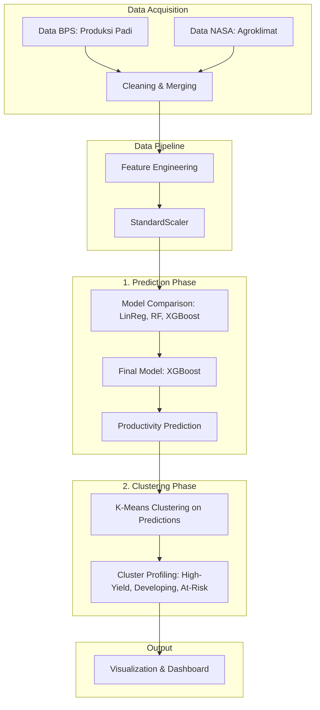

# 📊 Predictive Analytics Module

This project utilizes Linear Regression, Random Forest, and XGBoost models to predict rice yield based on climate and production data, with XGBoost identified as the superior model for its stability and robustness. As summarized in the evaluation table, XGBoost achieved the best performance on validation data with an RMSE of 25,687.45 and an $R^2$ score of 0.9857, effectively outperforming the other algorithms while demonstrating the most reliable generalization capabilities.

# 🛠 Tech Stack

           

# 📂 Data Pipeline
| Stage | Process | Description |
| :--- | :--- | :--- |
| **1. Acquisition** | Data Source | Data gathered from [BPS Indonesia](https://drive.google.com/drive/folders/1pkZYGE-BFCTxWRFDj6iGC-lc8rEWunfz?usp=drive_link) and [NASA POWES](https://drive.google.com/drive/folders/1cQ_a_sCR0P-Sl6VrhRNRoKtOZndseEIz?usp=drive_link). |
| **2. Cleaning** | Data Preprocessing  | Handling missing values, removing outliers, and normalizing column names. |
| **3. Engineering** | Feature Extraction | Transforming variables to enhance the predictive power of the model. |
| **4. Training** | Model Development | Training multiple models (LR, RF, XGB) with 5-fold cross-validation. |
| **5. Evaluation** | Performance Analysis | Generating metrics, logs, and artifacts (.joblib) for deployment. |

# ⚙️ Architecture

1. **Data Acquisition Layer:** This layer serves as the foundation, integrating heterogeneous data from two primary sources: BPS (Statistics Indonesia) for crop production metrics and NASA for historical agrometeorological data (temperature and rainfall).

2. **Data Preprocessing Layer:** To ensure model robustness, this layer handles data cleaning and feature engineering. We apply StandardScaler to normalize data scales, creating a consistent baseline for our machine learning models.

3. **Prediction Phase:** In this phase, we conduct a multi-model comparison (Linear Regression, Random Forest, and XGBoost). XGBoost is established as the final model to predict agricultural productivity based on environmental variables.

4. **Clustering Phase:** We utilize the K-Means algorithm to group the predicted productivity outcomes into distinct regional profiles (e.g., High-Yield, Developing, and At-Risk). This allows us to categorize districts based on their predicted potential rather than just historical averages.

5. **Output & Insight Layer:** The final layer combines predictive results with cluster insights, visualized through dashboards to support evidence-based decision-making.

### Dataset Overview & Splitting
The dataset consists of 2,529 total entries, which were split to ensure robust model training and evaluation:
- The dataset comprises 2,529 entries
   - 2,023 rows (80%) for training
   - 506 rows (20%) for validation
   - 506 rows (20%) for final testing.

This project utilizes three supervised learning algorithms to predict rice yield. The models were evaluated using 5-fold cross-validation to ensure reliable performance and to minimize the risk of overfitting.

### models
| Model | Purpose |
| :--- | :--- |
| Linear Regression | Baseline Prediction |
| Random Forest | Non-linear Modeling |
| XGBoost | High Performance |

# 🚀 Usage

To run this project on your local machine, please follow these steps:
### 1. Clone the Repository

First, download the project to your local computer:
```
git clone https://github.com/TurnNull/capstone-model-temporary/
cd your-project-repo
```
### 2. Install Dependencies

```
pip install -r requirements.txt
```
### 3. Running the Experiments (Jupyter Notebook)

All exploration and modeling processes are located in the notebooks/ folder. You can open them using Jupyter Notebook:
- exploratory_data analyisis/ (Exploratory Data Analysis)
   - eda_bps.ipynb
   - eda_nasa.ipynb
   - merge_data.ipynb
- linear_regression.ipynb (Baseline Linear Regression Model Tuning)
- random_forest.ipynb (Random Forest Tuning)
- xgboost.ipynb (XGBoost Tuning)
- model_comparison.ipynb (Model Comparison and Evaluation)

# 📈 Results

### Model Performance Summary
The following table provides a comparison of the evaluation metrics (MAE, RMSE, and $R^2$) on the validation data:
| Model | Train MAE | Val MAE | Val RMSE | Val $R^2$ |
|:------|----------:|---------:|----------:|----------:|
| Linear Regression | 18,641.41 | 18,693.48 | 32,919.78 | 0.9766 |
| Random Forest | **4,945.94** | **13,679.02** | 28,843.17 | 0.9816 |
| XGBoost | 8,787.52 | 14,073.29 | **27,708.92** | **0.9829** |

### Analysis
- **Top Performing Model:** XGBoost was selected as the primary model, achieving the **lowest validation RMSE (27,708.92)** and the **highest validation $R^2$ score (0.9829)** among all evaluated models. These results indicate excellent predictive accuracy and strong generalization capability.
- **Model Generalization:** Both Random Forest and XGBoost demonstrated strong predictive performance on the validation data. However, XGBoost exhibited a slightly better balance between training and validation performance, achieving the highest validation $R^2$ and the lowest RMSE. Although Random Forest obtained the lowest validation MAE, it showed a slightly larger gap between training and validation metrics, suggesting mild overfitting compared to XGBoost.